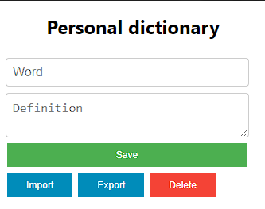

# Dictionary-extension

This is a dictionary extension for chrome.
It is a simple extension that allows you to search for a word in a personal dictionary.

## How to use
Open the extension (`Ctrl+Q`) and start typing the word you want to search. 

The extension will show you the definition of the word if it exists.

If the word doesn't exist, you can add it to the dictionary.

