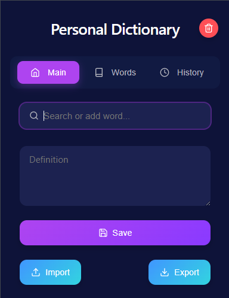
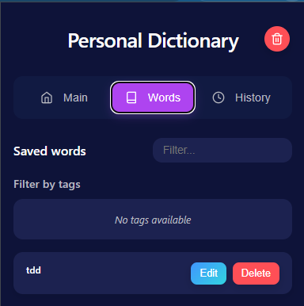
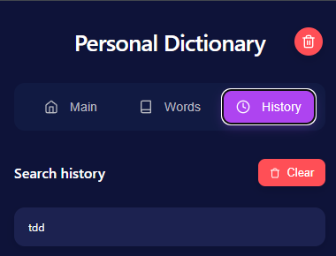

# Personal Dictionary Chrome Extension

Una extensión para Chrome que te permite crear y gestionar tu diccionario personal.

## Características

- **Búsqueda rápida**: Busca palabras en tu diccionario personal instantáneamente
- **Sistema de etiquetas**: Organiza tus definiciones con etiquetas usando el símbolo #
- **Historial de búsquedas**: Accede rápidamente a tus búsquedas recientes
- **Exportación/Importación**: Comparte tu diccionario en formatos JSON, CSV y TXT
- **Tema oscuro**: Interfaz moderna con diseño elegante
- **Lista de palabras**: Visualiza y filtra todas tus palabras guardadas

## Instalación

1. Descarga la extensión desde la [Chrome Web Store](https://chromewebstore.google.com/detail/personal-dictionary/mmemjkbopjpdfhkjkcamlpemhdjjebfl?hl=es)
2. Haz clic en "Añadir a Chrome"
3. La extensión aparecerá en tu barra de herramientas

## Cómo usar

### Añadir palabras
1. Abre la extensión (`Ctrl+Q` o haz clic en el ícono)
2. Escribe la palabra en el campo "Search or add word..."
3. Añade su definición en el campo "Definition"
4. Haz clic en "Save"

### Usar etiquetas
Añade etiquetas a tus definiciones usando el símbolo # seguido del nombre de la etiqueta:

```
Palabra que significa algo importante. #finanzas #economía
```

### Buscar palabras
1. Abre la extensión
2. Comienza a escribir en el campo de búsqueda
3. Selecciona la palabra de las sugerencias o presiona Enter

### Exportar/Importar
1. Haz clic en el botón "Export" o "Import"
2. Selecciona el formato deseado (JSON, CSV, TXT)

## Capturas de pantalla





## Contribuir

¿Encontraste un bug o tienes una sugerencia? Por favor, abre un issue o envía un pull request.

## Licencia

Este proyecto está bajo la licencia MIT.
